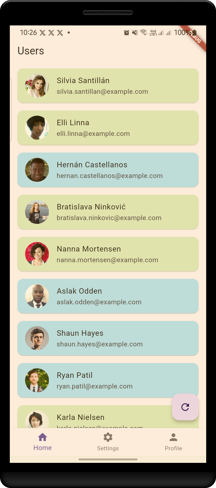
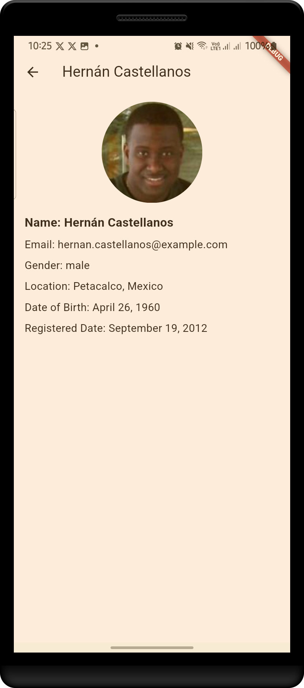

# 🧑‍🤝‍🧑 Flutter Random User Generator App

Welcome to the **Random User Generator App**! This Flutter app fetches random user data from the [RandomUser.me API](https://randomuser.me/) and displays it in an easy-to-read format. It also uses the `intl` package for date formatting and `provider` for state management to keep the app responsive and maintainable. It is a good start for anyone learning how to consume apis in flutter and utilising providers for state management! Reach out for any Question when stuck

## 🖼️ Screenshots

<!-- Add your screenshots here -->



## Features 🚀

- Fetches a list of 100 random users with details such as name, age, location, gender, and more!
- Date formatting using the `intl` package for user-friendly date displays.
- State management with the `provider` package to manage app states efficiently.
- Beautiful user interface that dynamically loads data and handles errors gracefully.
- Navigation to Individual user screen for more details.

## 🛠️ Tech Stack

- **Flutter**: For building the UI and handling the logic.
- **RandomUser.me API**: To fetch random user data.
- **intl**: For formatting dates in a user-friendly manner.
- **provider**: For state management across the app.

## 📦 Setup

Follow these simple steps to run the app locally:

1. Clone the repository:

   ```bash
   git clone https://github.com/Tillern/randomUser

2. Navigate to the project directory:
   ```bash
   cd random-user-generator

3. Install dependencies:  
   ```bash
   flutter pub get

4. Run the app:
   ```bash
   flutter run   


## 📖 How it Works
API Request: The app makes a GET request to the RandomUser.me API to fetch random user data.
Data Display: Once the data is fetched, it is displayed in a user-friendly list format with their name, gender, location, and date of birth (formatted using intl).
State Management: provider is used to manage the state of the app. It updates the UI whenever the data changes or the app is reloaded.
Date Formatting: The intl package ensures that the birthdates of users are displayed in a readable format like MM/dd/yyyy.


## 🔧 Features to Add
Implement pull-to-refresh to reload random users.
Add the ability to filter users by gender or age.
Save favorite users locally.
Styling the UI

## 💬 Contributing
Feel free to open issues, submit pull requests, or suggest features! This is an open-source project, and contributions are always welcome. Might help some else learn!

## bminodi@gmail.com
Reach out for help when stuck

## Happy coding! 🚀